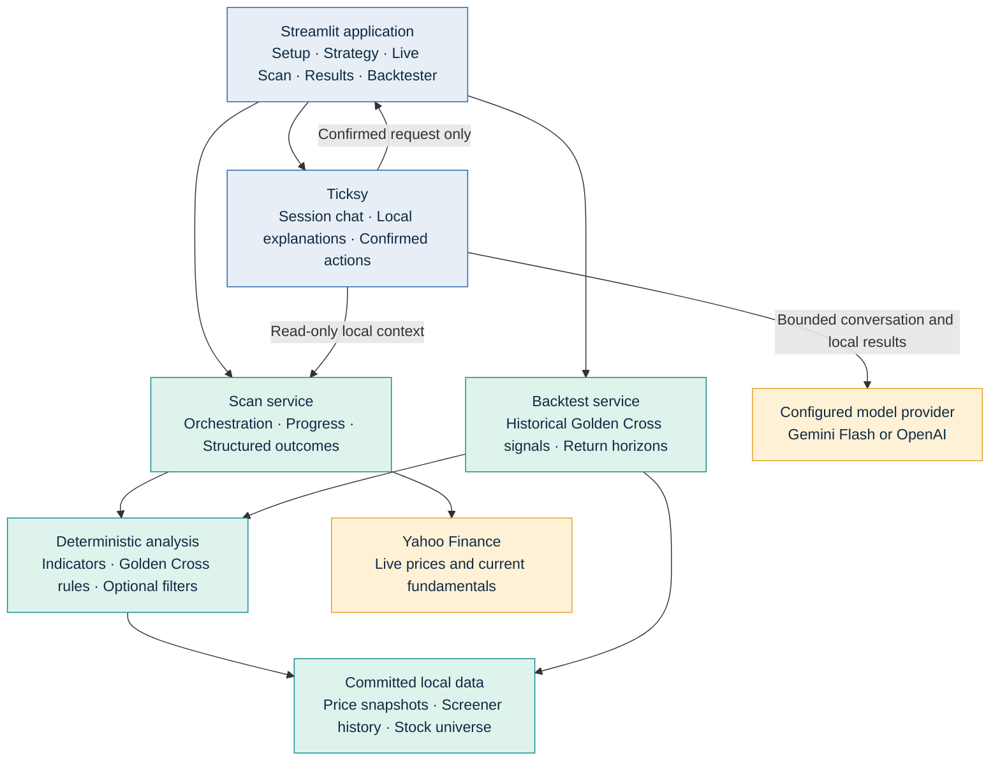

# Architecture

Stock Analyser YF is organized as a production-oriented layered application.

```text
Streamlit UI
    ↓
Scan Application Service
    ↓
Scanner Rules and Scoring
    ↓
Market Data and Fundamentals Providers
    ↓
Yahoo Finance, Screener Snapshots, Cache, and Observability
```

## High-Level Design



Ticksy can call the configured model provider only with bounded conversation
context and approved local results. It has no browser, news, RAG, or external
market-data tools; all calculations and rule decisions remain in Python.

## Current Components

- `ui/`: Streamlit pages, session-only scan presets, live scan insights,
  shared visual styling, formatted results, interactive charts, Backtester,
  and the Ticksy launcher.
- `ui/backtester_page.py`: selected-stock historical Golden Cross Backtester
  page with fixed return horizons and chart exploration.
- `ui/ticksy.py`: session-only Ticksy conversation UI, local explanations,
  action confirmation, and provider-disabled state.
- `models/scan_config.py`: immutable scan configuration and validation.
- `models/optional_filter.py`: immutable optional-filter definitions,
  thresholds, market-cap ranges, and Screener dependency classification.
- `models/scan_run.py`: typed Post-Cross, Impending-Cross, and failed outcomes
  with dataframe adapters for the UI.
- `services/scan_service.py`: scan orchestration with injected provider
  dependencies, structured failures, and optional accumulated-result callbacks
  for batched UI progress updates. Mandatory technical rules run before
  selected fundamental filters.
- `services/fundamental_filters.py`: isolated three-state (`pass`, `fail`, or
  `not evaluated`) evaluation for valuation, growth, quality, leverage, and
  market-cap filters.
- `providers/yahoo_finance.py`: retrying, TTL-cached Yahoo price batches with
  observable request, cache, retry, and failure counters.
- `providers/repository_data.py`: committed annual price partitions,
  fundamentals, industry benchmarks, manifest metadata, and missing-data-only
  Yahoo fallback. It also reads committed Screener summary/history snapshots.
  Small symbol requests use Parquet predicate filtering instead of
  materializing the complete snapshot. Screener summaries are indexed once
  per filtered scan rather than searched separately for every stock.
- `providers/screener.py`: bounded-retry parser for Screener company pages and
  ten-year P/E/TTM-EPS chart data. It calculates backend-only long-term
  valuation, growth, debt-to-equity, ROE, and latest OPM fields.
- `services/data_source.py`: constructs one consistent provider set for the
  source selected on the main screen.
- `services/scan_report.py`: pure workbook, chart-image, ZIP batching, email
  validation, message construction, and authenticated SMTP delivery helpers.
  The Streamlit UI supplies completed results and deployment-managed secrets;
  recipients are never persisted.
- `services/assistant_provider.py`: Gemini Flash and OpenAI provider boundary
  with a safe disabled provider, no external tool configuration, and a shared
  local-data-only system instruction.
- `services/assistant_tools.py`, `services/assistant_context.py`,
  `services/assistant_explanations.py`, and `services/assistant_actions.py`:
  bounded local context, deterministic explanations, and confirmed scan or
  Backtester action proposals.
- `models/assistant.py` and `models/assistant_action.py`: typed conversation,
  configuration, request, and proposed-action contracts.
- `scripts/refresh_market_data.py`: full backfill, incremental append, universe
  reconciliation, symbol-grouped Parquet optimization, semiannual
  classifications, industry P/E calculation, coverage reporting, and atomic
  manifest updates. It calculates backend-only PEG from refreshed Yahoo P/E
  and committed Screener 3-year profit growth.
- `.github/workflows/refresh-market-data.yml`: scheduled and manual snapshot
  validation and auto-commit workflow, with failure email notification through
  repository-managed Gmail SMTP secrets.
- `scripts/refresh_screener_fundamentals.py`: one throttled, resumable,
  batch-checkpointed refresh for every Screener-derived field and chart
  observation. It publishes versioned files through an atomic manifest.
- `.github/workflows/refresh-screener-fundamentals.yml`: monthly/manual
  Screener refresh, validation, commit, and failure-alert workflow.
- `core/data_loader.py`: symbol-universe loading and batch price retrieval.
- `core/scanner.py`: compatibility facade for legacy callers.
- Technical-analysis modules: indicators, Golden Cross, Short/Long-MA
  trajectories, pre-cross proximity and validation, and 52-week Long-MA
  high-to-trough recovery validation.
- `services/stock_universe.py`: resolves only the manifest-selected validated
  universe; no legacy symbol-file fallback is permitted.
- `core/fundamentals.py`: retried and cached fundamental-data retrieval.
- `services/industry_valuation.py`: NSE-only weighted and median industry P/E
  benchmarks calculated from Yahoo peer groups and cached for each scan.
- Committed classifications are maintained separately from daily fundamentals,
  preventing routine refreshes from erasing sector and industry values.
- `models/`: typed scan and failure-result contracts.

## Target Reliability Boundaries

- The UI must not contain market-data or scanner business logic.
- Normal scans and selected-stock chart expansion must not call Screener live;
  both read only the committed Screener snapshot.
- Every external request must have an observable success or failure outcome.
- Every scanned symbol must finish as either a qualified result or a structured
  failure result.
- Caches are an optimization only; results must identify their scan time and
  selected settings.
- User-named strategies are presentation/session state only. They must not
  mutate code-defined defaults or be persisted to Git.
- Report recipients remain session-only and SMTP credentials are read only
  from Streamlit Secrets or local environment variables.
- Optional filters start empty, persist through Streamlit reruns and named
  session strategies, and never create a third result group for missing data.
- Ticksy may send only bounded conversation context and approved local results
  to its configured model provider. Its Python tools never browse, fetch
  market data, use news, or use RAG; calculations remain deterministic Python
  services.
